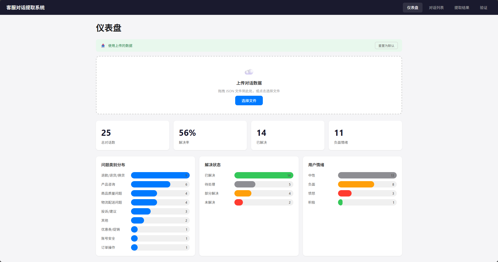
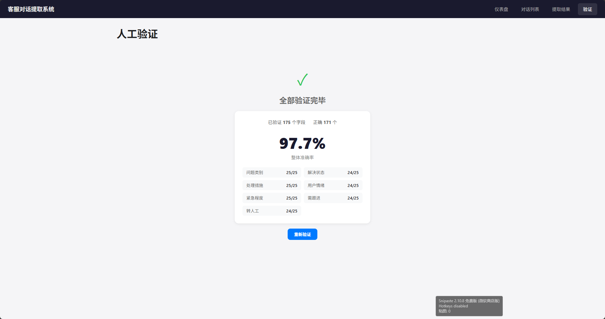

# 客服对话结构化提取工具

基于 LangChain + FastAPI + Vue 的全栈客服对话提取系统，支持仪表盘监测、人工验证准确率、JSON 数据文件上传。





## 项目结构

```
0108/
├── backend/                          # FastAPI 后端
│   ├── main.py                       # API 入口（16 个端点）
│   ├── extractor.py                  # LangChain 提取链
│   ├── models.py                     # Pydantic 数据模型
│   ├── data.py                       # 数据加载/统计/上传
│   ├── upload/                       # 浏览器上传的 JSON 数据文件
│   └── .env                          # API 配置
├── frontend/                         # Vue 3 前端
│   ├── src/
│   │   ├── App.vue                   # 根组件
│   │   ├── main.js                   # 入口 + 路由
│   │   ├── api/index.js              # Axios API 客户端
│   │   ├── views/
│   │   │   ├── DashboardView.vue     # 仪表盘（统计图表 + 上传）
│   │   │   ├── ConversationsView.vue # 对话列表 + 提取
│   │   │   ├── ResultsView.vue       # 提取结果展示
│   │   │   └── ValidationView.vue    # 人工验证界面
│   │   └── components/
│   │       └── NavBar.vue            # 导航栏
│   ├── vite.config.js                # Vite 配置（代理 /api）
│   ├── index.html
│   └── package.json
├── output/
│   └── extraction_results.json       # 提取结果
├── task/                              # 任务说明与示例数据
│   ├── task.md
│   ├── task2_conversations.json
│   └── task2_extract_example.md
├── .env / .env.example
├── .gitignore
├── requirements.txt
└── README.md
```

## Schema 设计

| 字段                    | 类型      | 说明                 |
| ----------------------- | --------- | -------------------- |
| `conversation_id`     | str       | 对话 ID              |
| `channel`             | str       | 渠道：在线 / 电话    |
| `agent`               | str       | 客服姓名             |
| `turn_count`          | int       | 对话轮次             |
| `user_issue_summary`  | str       | 诉求摘要             |
| `issue_categories`    | list[str] | 问题类别（支持多选） |
| `resolution_status`   | str       | 解决状态             |
| `resolution_action`   | str       | 处理措施             |
| `user_sentiment`      | str       | 用户情绪             |
| `urgency_level`       | str       | 紧急程度             |
| `requires_follow_up`  | bool      | 需跟进               |
| `escalation_required` | bool      | 转人工               |

## LangChain 提取链

提取链在 `backend/extractor.py` 中实现，分为三层：

### 1. LLM 配置

```python
llm = ChatOpenAI(
    model="deepseek-chat",
    api_key=...,
    base_url="https://api.deepseek.com/v1",
    temperature=0.01,
    model_kwargs={"response_format": {"type": "json_object"}},
)
```

- 通过 LangChain 的 `ChatOpenAI` 接入 DeepSeek API（兼容 OpenAI 协议）
- `temperature=0.01` 极低随机性，保证提取结果的稳定性
- `response_format={"type": "json_object"}` 强制 LLM 输出纯 JSON

### 2. 链的组装（LCEL）

```python
prompt = ChatPromptTemplate.from_messages([
    ("system", SYSTEM_PROMPT),
    ("human", "对话ID: {conv_id}\n渠道: {channel}\n客服: {agent}\n轮次: {turn_count}\n\n内容:\n{content}"),
])
chain = prompt | llm | JsonOutputParser()
```

三段式管道：

| 环节                 | 作用                                        |
| -------------------- | ------------------------------------------- |
| `prompt`           | 将对话变量填入模板，生成完整 prompt         |
| `llm`              | 发给 DeepSeek，得到 JSON 文本响应           |
| `JsonOutputParser` | 将 LLM 返回的 JSON 字符串解析为 Python dict |

**编码思路**：对话的元信息（渠道、客服名、轮次）作为显式输入字段传给 LLM，而非塞进 content 里——减少 LLM 的推断负担，降低幻觉。

### 3. 兜底机制

```python
try:
    result = chain.invoke(...)
except Exception:
    return fallback_extract(conv)
```

LLM 调用失败时立即降级到**关键词规则提取**，例如：

```
["退款", "退货", "换货"] → "退款/退货/换货"
["坏了", "碎了", "破损"] → "商品质量问题"
```

保证系统对外"100% 有结果"，单条 LLM 超时不中断整体流程。

### 4. 提取执行流程

```
对话原始数据
  → 格式化为 "用户: xxx\n客服: xxx\n..."
  → chain.invoke() 调用 LLM
  → 提取 12 个标准化字段
  → 保存到 output/extraction_results.json
```

## 边界情况处理

| 场景                         | 策略                                 |
| ---------------------------- | ------------------------------------ |
| 多诉求（conv_06）            | issue_categories 多标签              |
| 转人工（conv_09, conv_16）   | escalation_required=true             |
| 用户放弃（conv_12, conv_25） | resolution_status=unresolved         |
| 部分解决（conv_20, conv_21） | resolution_status=partially_resolved |
| LLM 调用失败                 | 规则兜底（keyword-based fallback）   |

## 运行方式

```bash
# 1. 配置 API Key
cp .env.example .env
# 编辑 .env 填入 DEEPSEEK_API_KEY

# 2. 安装依赖
pip install -r requirements.txt
# 前端依赖
cd frontend && npm install

# 3. 启动后端（Terminal 1）
conda activate 0108
cd backend && uvicorn main:app --reload --port 8000

# 4. 启动前端（Terminal 2）
cd frontend && npm run dev

# 浏览器打开 http://localhost:5173
```

## API 端点

| 方法 | 路径                   | 说明                      |
| ---- | ---------------------- | ------------------------- |
| POST | /api/upload            | 上传对话 JSON 数据文件    |
| GET  | /api/data-source       | 当前数据来源（默认/上传） |
| GET  | /api/conversations     | 对话列表                  |
| GET  | /api/conversations/:id | 单条对话                  |
| POST | /api/extract           | 提取单条                  |
| POST | /api/extract-all       | 提取全部                  |
| GET  | /api/results           | 提取结果                  |
| GET  | /api/results/:id       | 单条结果                  |
| GET  | /api/stats             | 统计概览                  |
| POST | /api/validate          | 单字段验证                |
| POST | /api/validate/batch    | 批量验证                  |
| GET  | /api/validate/summary  | 验证报告                  |

## AI 工具使用

- **LangChain**（ChatOpenAI + JsonOutputParser + ChatPromptTemplate）：结构化提取链
- **FastAPI**：REST API
- **Vue 3 + Vite**：前端 SPA
- **DeepSeek API**：底层 LLM
